# Database Design

## Entity Relationship Diagram

```mermaid
erDiagram
    users {
        uuid id PK
        varchar email UK
        timestamp created_at
        timestamp updated_at
    }

    auth_accounts {
        uuid id PK
        uuid user_id FK
        varchar provider
        varchar provider_account_id
        text password_hash
        timestamp created_at
        timestamp updated_at
    }

    player_profiles {
        uuid id PK
        uuid user_id FK
        varchar username UK
        varchar display_name
        text avatar_url
        timestamp created_at
        timestamp updated_at
    }

    game_rooms {
        uuid id PK
        uuid host_user_id FK
        room_status status
        int max_players
        jsonb settings_json
        uuid winner_user_id FK
        timestamp created_at
        timestamp started_at
        timestamp finished_at
    }

    game_room_players {
        uuid id PK
        uuid room_id FK
        uuid user_id FK
        int seat_index
        timestamp joined_at
        timestamp left_at
        int final_score
    }

    game_rounds {
        uuid id PK
        uuid room_id FK
        int round_number
        uuid dealer_user_id FK
        jsonb turn_order_json
        round_status status
        uuid current_turn_user_id FK
        turn_phase turn_phase
        bool did_take_from_discard
        jsonb hidden_deck_json
        jsonb discard_pile_json
        int highest_table_total
        round_end_reason end_reason
        uuid finisher_user_id FK
        timestamp created_at
        timestamp started_at
        timestamp finished_at
    }

    game_round_hands {
        uuid id PK
        uuid round_id FK
        uuid user_id FK
        jsonb cards_json
        bool has_gone_down
        int table_total
        timestamp updated_at
    }

    game_round_discards {
        uuid id PK
        uuid round_id FK
        uuid user_id FK
        int move_number
        jsonb card_json
        jsonb pile_after_json
        timestamp created_at
    }

    game_moves {
        uuid id PK
        uuid round_id FK
        uuid user_id FK
        int move_number
        move_action_type action_type
        jsonb action_json
        jsonb hand_before_json
        jsonb hand_after_json
        timestamp created_at
    }

    game_melds {
        uuid id PK
        uuid round_id FK
        uuid owner_user_id FK
        meld_type meld_type
        jsonb cards_json
        int total_value
        timestamp created_at
        timestamp updated_at
    }

    game_meld_cards {
        uuid id PK
        uuid meld_id FK
        uuid round_id FK
        int position
        varchar card_rank
        varchar card_suit
        bool is_joker
        int deck_index
        int joker_index
        uuid added_by_user_id FK
        timestamp added_at
    }

    game_scores {
        uuid id PK
        uuid round_id FK
        uuid room_id FK
        uuid user_id FK
        int table_total
        int hand_total
        int round_score
        int finish_bonus
        int final_score
        int cumulative_score_after
        timestamp created_at
    }

    leaderboard_entries {
        uuid id PK
        uuid user_id FK
        int games_played
        int games_won
        bigint total_score
        int highest_round_score
        timestamp updated_at
    }

    match_history {
        uuid id PK
        uuid room_id FK
        uuid winner_user_id FK
        int rounds_played
        jsonb player_results
        timestamp started_at
        timestamp finished_at
    }

    users ||--o{ auth_accounts : "has"
    users ||--o| player_profiles : "has"
    users ||--o{ game_room_players : "joins"
    users ||--o| leaderboard_entries : "has"

    game_rooms ||--o{ game_room_players : "contains"
    game_rooms ||--o{ game_rounds : "has"
    game_rooms ||--o| match_history : "summarised by"

    game_rounds ||--o{ game_round_hands : "deals"
    game_rounds ||--o{ game_round_discards : "records"
    game_rounds ||--o{ game_moves : "logs"
    game_rounds ||--o{ game_melds : "tracks"
    game_rounds ||--o{ game_scores : "produces"

    game_melds ||--o{ game_meld_cards : "normalised as"
```

## Key Design Decisions

### Dual-representation for card data

Card arrays (deck, hands, discard pile, meld snapshots) are stored as **JSONB** for fast reads. Melds additionally maintain a normalised `game_meld_cards` table so SQL queries can filter/aggregate by rank, suit, or who added a card without parsing JSON.

### Immutable audit log

`game_moves` is append-only. Combined with the initial dealt hands in `game_round_hands`, the full game can be replayed deterministically from the move log. No rows are ever deleted.

### Cumulative score denormalisation

`game_scores.cumulative_score_after` stores the running total after each round so the leaderboard/standings view never requires a SUM aggregate — just grab the latest row per player per room.

### Commerce tables (disabled)

`products`, `product_prices`, `orders`, `payments`, `entitlements`, and `user_inventory` are included in the schema (migration 003) but no server routes expose them. Every product row defaults to `is_active = FALSE`. These tables can be activated without a schema migration when payments are ready.

### Multi-provider auth

`auth_accounts` supports one row per `(user_id, provider)`. A constraint ensures OAuth rows carry a `provider_account_id` and password rows carry a `password_hash` — never both null or both present for the wrong provider type.

### Seat ordering

`game_room_players.seat_index` is unique per room and assigned sequentially. Turn order in `game_rounds.turn_order_json` is a snapshot array of user IDs taken at deal time, so seat changes during a round can't affect it.

### Indexes

All foreign keys are indexed. Additional indexes:
- `game_rounds(room_id, status)` — find the active round for a room in O(log n)
- `game_melds(round_id, owner_user_id)` — find a player's melds quickly
- `game_moves(round_id, move_number)` — replay in order
- `leaderboard_entries(total_score DESC)` — leaderboard sort
- Partial index on `entitlements` for active (non-revoked, non-expired) rows
